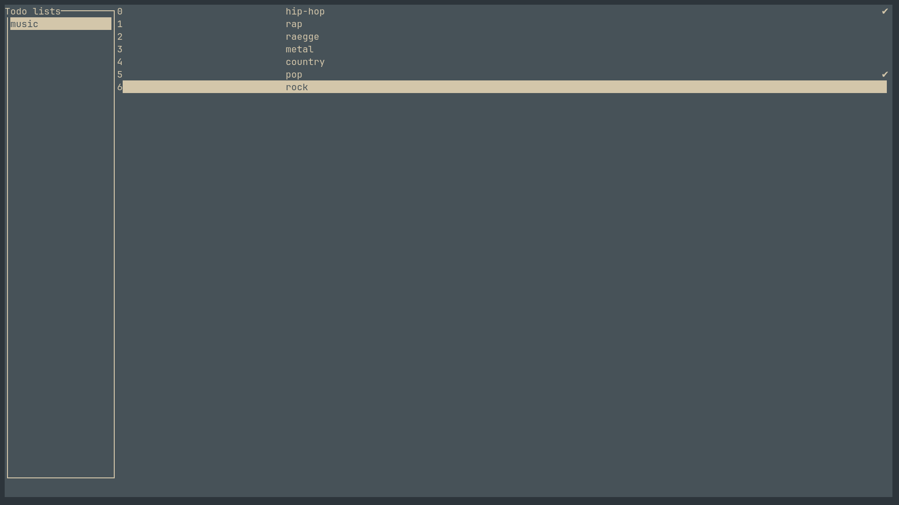
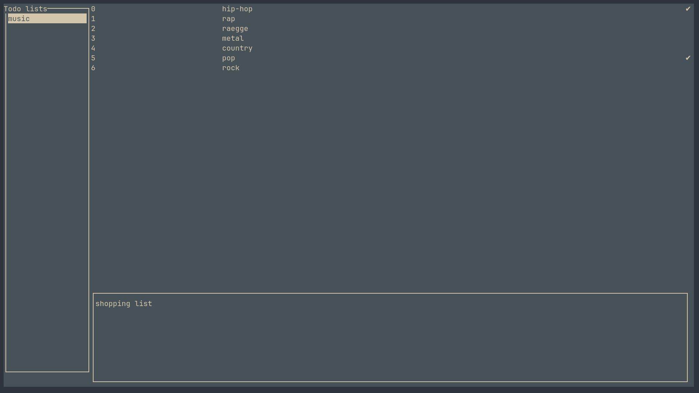

<!-- Title="Codo" -->
<!-- Date="04.01.2025" -->

# What is it?

Codo is a TUI(terminal-user-interface) application for Linux operating system written in C programming language,
which uses <a href="https://pubs.opengroup.org/onlinepubs/7908799/xcurses/curses.h.html" target="_blank">ncurses</a> for UI and <a href="https://sqlite.org/docs.html" target="_blank">SQlite</a> for database management. 

*Example image of Codo running*

 

# State of the application

As of time of writing this Codo users are able to to create, edit and delete their todo-lists, the same goes for tasks. Tasks can be marked as done, when
all of tasks in a same todo-list are done, the todo-list is also marked as done. I'm currently working on a subtaks feature, which is about 90% done.

*Creating new todo-list*

 

# Future

I'm planning to add some new functionalities that would enhace the use of application in various ways. Details windows would
enable users to inspect their task and todo-list to see more information about them, e.g. number of tasks in a list and list's description, same goes for tasks.
Another addition would be keymaps, which could be used to smoothly operate in Codo app in vim-like fashion, those keymaps of course could be changed via configuration file. Next thing that could be changed with use of those config files would be color theme of the application and default icons for various elements of the UI, e.g. tick icon, which appears when task or list is done. Last but not least the search option to easily and efficiently find tasks by their name or description, especially useful when the list grows to tens or hunderds of tasks.

 

## Here's a list of completed features and those planned for the future:
- [X] Task operations
    - [X] Add
    - [X] Delete
    - [X] Edit
    - [X] Change status
- [X] List operations
    - [X] Add
    - [X] Delete
    - [X] Edit
    - [X] Change status
- [ ] Subtasks (in-progress)
- [ ] Details window
- [ ] Color themes
- [ ] Keymaps
- [ ] Config files
- [ ] Search
- [ ] Scalable interface

 

# I'm really proud of:
- Custom array data structure, which can hold any type
- Deeper understanding and knowledge of C programming language

# Links:
- <a href="https://github.com/Korbielowski/codo/tree/main" target="_blank">Source code</a>
- <a href="https://tldp.org/HOWTO/NCURSES-Programming-HOWTO/index.html" target="_blank">NCURSES Programming HOWTO</a>